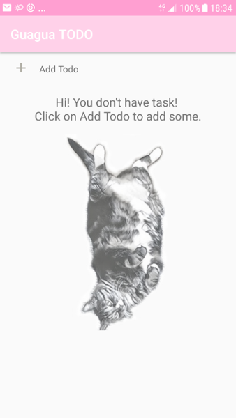

# Guagua Todo

A simple TODO app, named by Guagua -- my soft and furry friend.

The app is written in Kotlin, uses RxJava and Room. 

The app has 3 views:
1. The todo item list view: where you can check and star the item, and the changes are saved to DB.
2. The add new todo task view: where you define title, date and optional extra info of the task.
3. The todo item detail view: where you can edit the detail of the item, delete the item. Changes are propagated to DB.

  
  
  
  

